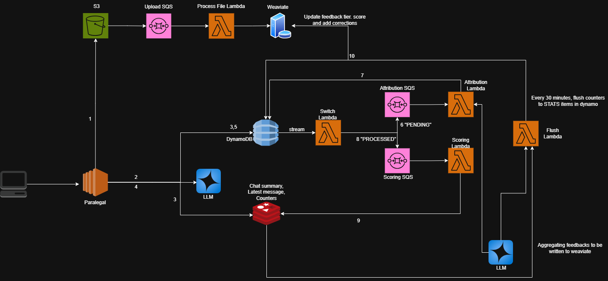

# ⚖️ Paralegal

An advanced **Retrieval-Augmented Generation (RAG)** platform designed for legal intelligence. **Paralegal** doesn't just answer questions—it actively maintains its own knowledge base through a sophisticated **autonomous self-correction and reputation pipeline**.

---

## 🚀 Overview

Paralegal is built to solve the "hallucination problem" in legal AI. It features an event-driven architecture that tracks every retrieved chunk of information, allowing users to provide granular feedback that directly heals the system.

### **Core Innovation: The Healing Pipeline**
Unlike traditional RAG systems, Paralegal features a built-in cycle of improvement:
- **LLM-Based Attribution**: Feedback is surgically mapped back to the source document using LLM reasoning (not just vector similarity).
- **Reputation Tiering**: Chunks accumulate scores. High-performing chunks are prioritized; failing chunks are "penalized" or "flagged" for exclusion.
- **Autonomous Hot-Patching**: If a document is found to be incorrect, the system applies a "Correction Layer" that overrides the source text at query time until a human can update the file.

---

## 🛠️ Tech Stack

- **Runtime**: [Bun](https://bun.sh/) + TypeScript
- **API Framework**: [Express](https://expressjs.com/)
- **Vector Database**: [Weaviate](https://weaviate.io/)
- **LLM Engine**: [LangChain](https://www.langchain.com/) + [OpenAI](https://openai.com/)
- **Cloud (Local Dev)**: [LocalStack](https://localstack.cloud/) (Mocking S3, DynamoDB, SQS, Lambda)
- **Infrastructure**: [Terraform](https://www.terraform.io/)
- **State Management**: [Redis](https://redis.io/) (Real-time counters & caching)

---

## 💻 Local Setup

### **Prerequisites**
- [Docker](https://www.docker.com/)
- [Bun](https://bun.sh/)
- [AWS CLI](https://aws.amazon.com/cli/)
- `jq` (Command-line JSON processor)
- [Terraform](https://www.terraform.io/)

### **Installation**

1. **Clone the repository and install dependencies:**
   ```bash
   bun install
   ```

2. **Configure Environment Variables:**
   Create a `.env` file in the root directory:
   ```env
   OPENAI_API_KEY=your_openai_api_key_here
   ```

3. **Spin up Infrastructure:**
   On Windows (using Git Bash) or Linux/macOS, run the automated setup script. This script handles containerization, waiting for services to be ready, and provisioning AWS resources via Terraform:
   ```bash
   ./scripts/setup-localstack.sh
   ```

4. **Set Local AWS Credentials:**
   To interact with the local infrastructure via AWS CLI, export the following (or use the equivalent PowerShell commands):
   ```bash
   # Bash
   export AWS_ACCESS_KEY_ID=test
   export AWS_SECRET_ACCESS_KEY=test
   export AWS_DEFAULT_REGION=ap-south-1
   export AWS_ENDPOINT_URL=http://localhost:4566

   # PowerShell
   $env:AWS_ACCESS_KEY_ID = "test"
   $env:AWS_SECRET_ACCESS_KEY = "test"
   $env:AWS_DEFAULT_REGION = "ap-south-1"
   ```

---

## 🏃 Running the Application

Once the infrastructure is ready, start the development server:
```bash
bun run dev
```

The Express server will be listening at `http://localhost:3000`.

---

## 🛰️ API Endpoints

| Method | Endpoint | Description |
| :--- | :--- | :--- |
| `POST` | `/upload` | Upload a PDF document for ingestion and chunking. |
| `POST` | `/query` | Query the legal intelligence engine. |
| `POST` | `/feedback` | Submit user feedback on a response (e.g., "Factually incorrect"). |
| `GET` | `/health` | Check the system status. |

---

## 📂 Architecture Detail



### **Infrastructure Components**
| Component | Role |
| :--- | :--- |
| **Weaviate** | Stores knowledge base chunks, embeddings, and reputation tiers. |
| **Redis** | High-speed buffer for retrieval/penalty counts and chat summaries. |
| **DynamoDB** | System-of-record for conversation history, feedback, and stat aggregation. |
| **SQS** | Decouples feedback routing from attribution and scoring lambdas. |
| **Lambdas** | Async workers for document processing, scoring, and correction. |

### **The Query-Feedback Flow**
1. **Log**: Every query logs the specific chunk IDs retrieved.
2. **Review**: User submits feedback via the API.
3. **Route**: The **Switch Lambda** determines if it requires **Attribution** (LLM-based error mapping) or **Scoring**.
4. **Heal**: If attributed to a chunk, the **Correction Layer** hot-patches future responses until the source file is permanently updated.
